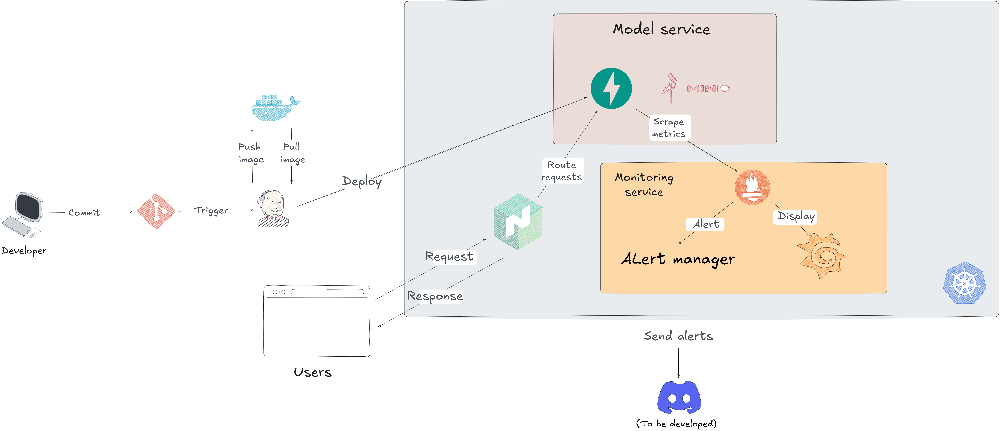

This tutorial shows how to deploy a simple house price prediction model.

## I. Prerequisites

This document describes the required tools and environments along with official installation guides. Please ensure all tools below are properly installed before proceeding.

---

## 1. Ubuntu

Ubuntu is the recommended operating system for this setup.

### Installation Guide

* Ubuntu Dualboot: 
  [https://www.onlogic.com/blog/how-to-dual-boot-windows-11-and-linux/](https://www.onlogic.com/blog/how-to-dual-boot-windows-11-and-linux/)

## 2. AWS CLI

AWS Command Line Interface allows you to manage AWS services from the terminal.

### Installation Guide

* Official AWS CLI Install Guide:
  [https://docs.aws.amazon.com/cli/latest/userguide/getting-started-install.html](https://docs.aws.amazon.com/cli/latest/userguide/getting-started-install.html)

Verify installation:

```bash
aws --version
```

Configure AWS CLI:

```bash
aws configure
```

* Create key pair

  [https://docs.aws.amazon.com/AWSEC2/latest/UserGuide/create-key-pairs.html](https://docs.aws.amazon.com/AWSEC2/latest/UserGuide/create-key-pairs.html)

---

## 3. Google Cloud SDK (gcloud CLI)

gcloud CLI is used to manage Google Cloud resources.

### Installation Guide

* Official Installation Guide:
  [https://cloud.google.com/sdk/docs/install](https://cloud.google.com/sdk/docs/install)

Verify installation:

```bash
gcloud --version
```

Initialize gcloud:

```bash
gcloud init
```

---

## 4. Helm

Helm is a package manager for Kubernetes.

### Installation Guide

* Official Helm Install Guide:
  [https://helm.sh/docs/intro/install/](https://helm.sh/docs/intro/install/)

Verify installation:

```bash
helm version
```

---

## 5. Minikube

Minikube allows you to run Kubernetes locally.

### Installation Guide

* Official Minikube Install Guide:
  [https://minikube.sigs.k8s.io/docs/start/](https://minikube.sigs.k8s.io/docs/start/)

Start Minikube:

```bash
minikube start
```

Verify installation:

```bash
minikube status
```

---

## 6. Docker

Docker is required to build and run containers.

### Installation Guide

* Official Docker Install Guide for Ubuntu:
  [https://docs.docker.com/engine/install/ubuntu/](https://docs.docker.com/engine/install/ubuntu/)

Verify installation:

```bash
docker --version
docker ps
```

Optional: Run Docker without sudo

```bash
sudo usermod -aG docker $USER
newgrp docker
```

---

## 7. SSH Key

SSH keys are required for secure access to remote Git repositories and servers.

### Generate SSH Key

```bash
ssh-keygen -t ed25519 -C "your_email@example.com"
```

Start SSH agent:

```bash
eval "$(ssh-agent -s)"
ssh-add ~/.ssh/id_ed25519
```

Display public key:

```bash
cat ~/.ssh/id_ed25519.pub
```

### Add SSH Key to Git Server

* GitHub SSH Key Guide:
  [https://docs.github.com/en/authentication/connecting-to-github-with-ssh](https://docs.github.com/en/authentication/connecting-to-github-with-ssh)
* GitLab SSH Key Guide:
  [https://docs.gitlab.com/ee/user/ssh.html](https://docs.gitlab.com/ee/user/ssh.html)

---

## II. How-to Guide

### 1. Start Jenkins service locally
```shell
docker compose -f jenkins/docker-compose.yaml up -d
```
You can find the password for `admin` at the path `/var/jenkins_home/secrets/initialAdminPassword` in the container Jenkins.

### 2. Start your cloud infrastructure
```shell
cd iac/terraform_aws/ 
or cd iac/terraform_gcp/
terraform init
terraform plan
terraform apply
```

### 3. Connect to cluster
```shell
#GCP
gcloud container clusters get-credentials inner-replica-469607-h9-new-gke --zone europe-west3-a --project inner-replica-469607-h9

#AWS
aws eks update-kubeconfig --region region-code --name my-cluster

#Verify cluster connection
kubectl get nodes
```
#### Create service account for cluster
```shell
#Get the cluster CA certificate
kubectl config view --raw --minify -o jsonpath='{.clusters[*].cluster.certificate-authority-data}' | base64 --decode > jenkins/ca.crt

#Create namespace model-serving
kubectl create ns model-serving

#(Optional) Switch to model-serving namespace
kubens model-serving

#Create a ServiceAccount for Jenkins
kubectl create sa jenkins -n model-serving

#Apply ClusterRoleBinding for the Jenkins SA
kubectl apply -f jenkins/jenkins-sa.yaml   # This file should bind the 'jenkins' SA to cluster-admin role

#Create a secret containing the SA token and CA certificate
kubectl create secret generic jenkins-sa-secret \
  --from-literal=token=$(kubectl create token jenkins -n model-serving) \
  --from-file=ca.crt=jenkins/ca.crt \
  -n model-serving

#Verify the token inside the secret
kubectl get secret jenkins-sa-secret -n model-serving -o jsonpath='{.data.token}' | base64 --decode

#Get the SA token to use directly in a .env file for Jenkins
kubectl create token jenkins -n model-serving  # Copy output to K8S_SA_TOKEN

#Create a secret for the model API (MinIO credentials)
kubectl create secret generic model-api-secrets \
  --from-literal=MINIO_ACCESS_KEY=root \
  --from-literal=MINIO_SECRET_KEY=password \
  -n model-serving
```
### 4. Create MinIO to host model
```shell
kubectl apply -f minio-k8s/
```

### 5. Helm charts

#### For model API
```shell
cd helm-charts/hpp/
helm upgrade --install hpp .
```

#### For monitoring tools
```shell
helm repo add prometheus-community https://prometheus-community.github.io/helm-charts
helm repo add stable https://charts.helm.sh/stable
helm repo update
helm install prometheus prometheus-community/kube-prometheus-stack
### Install chart with fixed version
helm install prometheus prometheus-community/kube-prometheus-stack --version "9.4.1"
```

### 6. Push the whole code to Github for automatic deployment
```shell
git add --all
git commit -m "first attempt to deploy the model"
git push origin your_branch
```